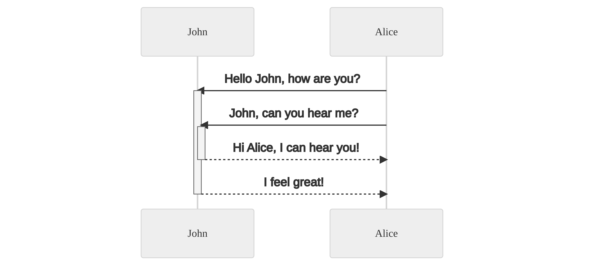
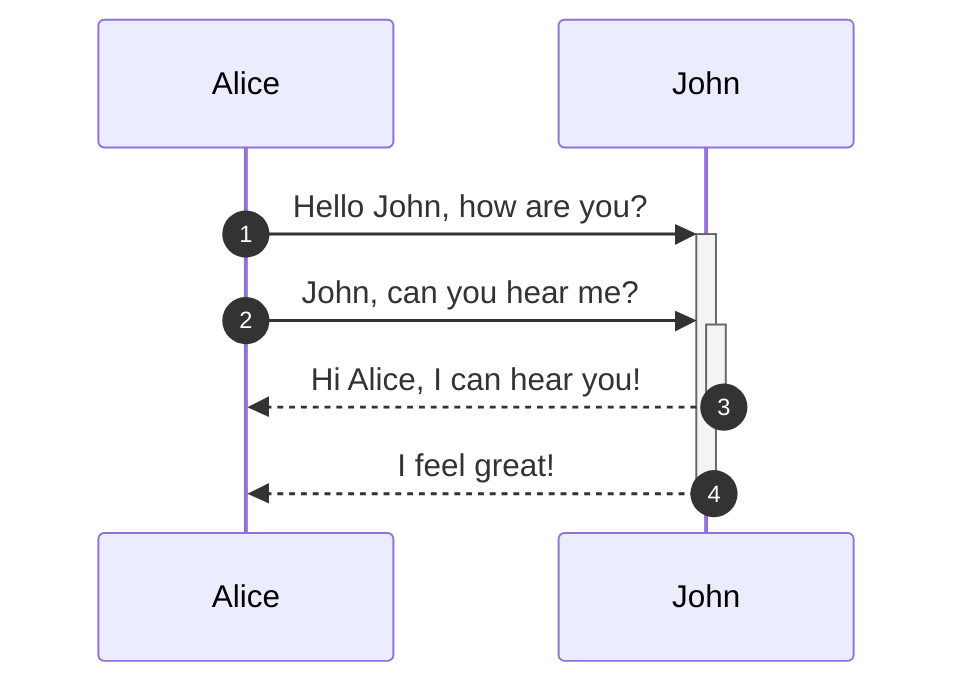
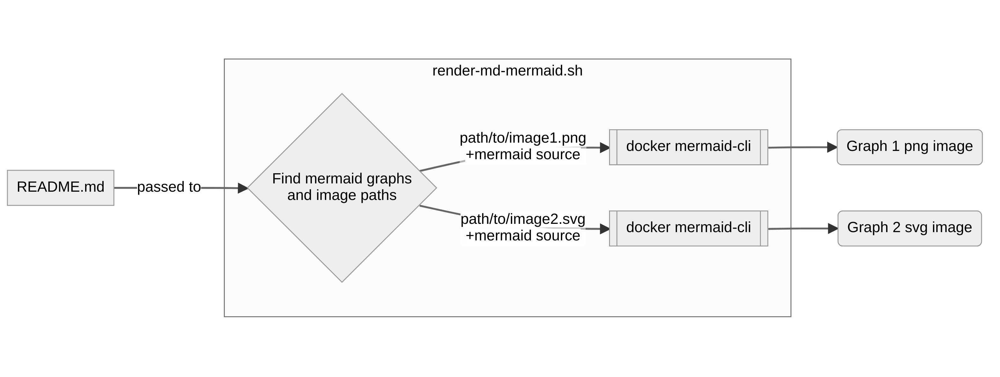
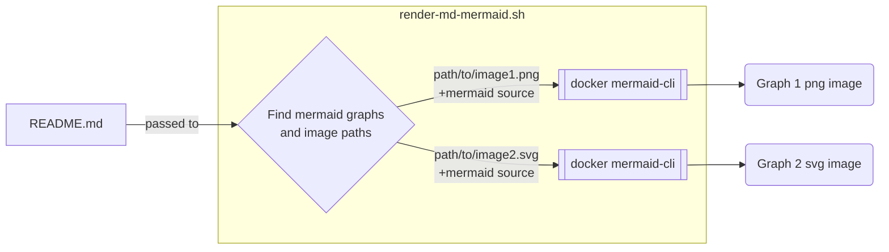

# bitsandbobs
Some of my code kept where I can find it

  
diagram source

  
diagram source

  This details block is collapsed by default when viewed in GitHub. This hides the mermaid graph definition, while the rendered image
  linked above is shown. The details tag has to follow the image tag. (newlines allowed)

# Create the diagrams localy
Instead one can save the plantuml in a file with `.plantuml` extension and then run make.
The Makefile will create the scv image, and an html file making it easy to view the image with a browser. When you are happy you can just insert the diagram into the README.md file:

``

OR

``
