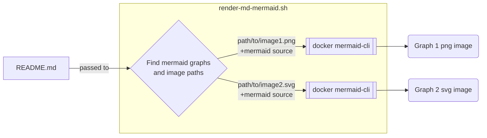
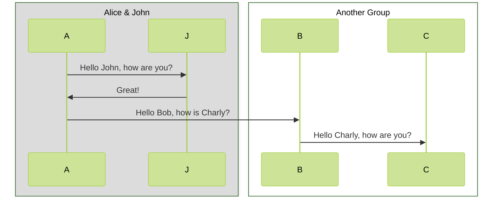

# bitsandbobs
Some of my code kept where I can find it


## test how mermaid graphs are rendered in github markdown



## Attempting to render mermaid with new grouping



## Mermaid with AWS icons

```mermaid
architecture-beta
    service dns(logos:aws-route53)[Route 53]
    service cf(logos:aws-cloudfront)[CloudFront]
    service lb(logos:aws-ec2)[Load Balancer]
    service ui(logos:nextjs)[UI]
    service gateway(logos:aws-api-gateway)[API Gateway]
    service auth(logos:aws-lambda)[Auth Service]
    service authDb(logos:aws-dynamodb)[Auth DB]
    auth:R --> L:authDb
    service blog(logos:aws-lambda)[Blog Service]
    service blogDb(logos:aws-dynamodb)[Blog DB]
    blog:R --> L:blogDb
    service analytics(logos:aws-lambda)[Analytics Service]
    service analyticsIndex(logos:aws-open-search)[OpenSearch]
    analytics:R --> L:analyticsIndex
    dns:R --> L:cf
    cf:R --> L:lb
    lb:B --> T:ui
    cf:R --> L:gateway
    gateway:R --> L:auth
    gateway:R --> L:blog
    gateway:R --> L:analytics
```



## Using links

```mermaid
flowchart TB

subgraph ACCOUNT[AWS Account]
  subgraph GRP1[" "]
    ELB@{ img: "https://api.iconify.design/logos/aws-elb.svg", label: "ELB", pos: "b", w: 60, h: 60, constraint: "on" }
  end
  subgraph GRP2[" "]
    EC2@{ img: "https://api.iconify.design/logos/aws-ec2.svg", label: "EC2", pos: "b", w: 60, h: 60, constraint: "on" }
  end
  subgraph GRP3[" "]
    RDS@{ img: "https://api.iconify.design/logos/aws-rds.svg", label: "RDS", pos: "b", w: 60, h: 60, constraint: "on" }
  end
  ELB --- EC2 --- RDS
end

classDef vpc fill:none,color:#0a0,stroke:#0a0
class ACCOUNT vpc

classDef group fill:none,stroke:none
class GRP1,GRP2,GRP3 group
```

