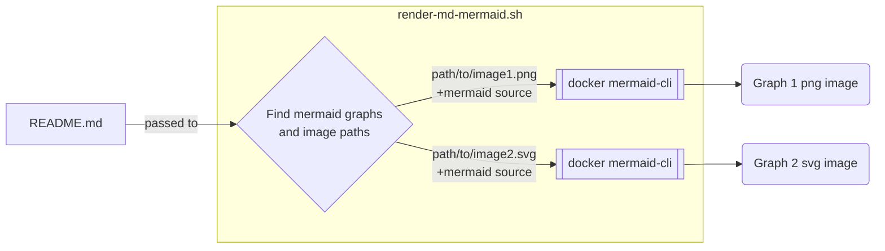
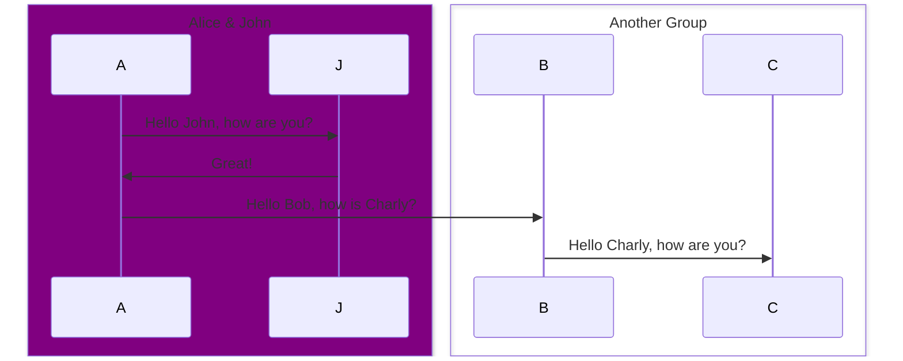

# bitsandbobs
Some of my code kept where I can find it

## test how mermaid graphs are rendered in github markdown

```mermaid
graph LR
    A[README.md]
    B{Find mermaid graphs<br>and image paths}
    C[[docker mermaid-cli]]
    D[[docker mermaid-cli]]
    E(Graph 1 png image)
    F(Graph 2 svg image)

    A -->|passed to| B
    subgraph render-md-mermaid.sh
      B --> |path/to/image1.png<br>+mermaid source| C
      B --> |path/to/image2.svg<br>+mermaid source| D
    end
    C --> E
    D --> F
```

## Attempting to render mermaid with new grouping

```mermaid
sequenceDiagram
    box Purple Alice & John
    participant A
    participant J
    end
    box Another Group
    participant B
    participant C
    end
    A->>J: Hello John, how are you?
    J->>A: Great!
    A->>B: Hello Bob, how is Charly?
    B->>C: Hello Charly, how are you?
```

